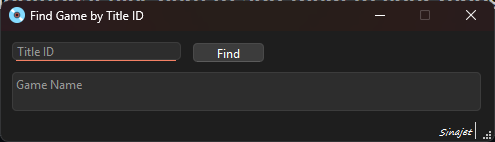

# 🎮 Game Name Finder by Title ID  
A simple tool for retrieving the names of **PS4** and **PS5** games using their **Title ID**.

---

## 📌 About the Project
This is a lightweight and easy‑to‑use application that allows you to quickly find the full name of PlayStation 4 and PlayStation 5 games by entering their Title ID.

It’s especially useful for developers, modders, archivists, and anyone who works with PlayStation game metadata.

---

## 🔍 How It Works
The application fetches game names from the following websites:

- https://prosperopatches.com  
- https://orbispatches.com  

**PPSA** Title IDs are searched on **ProsperoPatches**  
**CUSA** Title IDs are searched on **OrbisPatches**

⚠️ **Important Note:**  
If either of these websites becomes unavailable, the application will no longer be able to retrieve game names.

---

## 🖥️ Features
- Clean and simple PyQt6 interface  
- Supports both PS4 (CUSA) and PS5 (PPSA) Title IDs  
- Fast game name lookup  
- Non‑blocking UI using threaded requests  
- Pre‑built executable (EXE) available for non‑Python users  

---

## 📦 Executable Release
A compiled **EXE version** of the application is available in the **Releases** section of this repository.  
You can run it without installing Python.

---

## 🛠️ Technologies Used
- Python 3  
- PyQt6  
- Requests  
- BeautifulSoup4  

---

## 🚀 Running from Source
```bash
pip install -r requirements.txt
python main.py
```

---

## 📸 Screenshot
 <br>

---

## 📄 License
This project is released under the MIT License.  
You are free to use, modify, and distribute it.

---

## 🙌 Author
Developed by **Sinajet**
